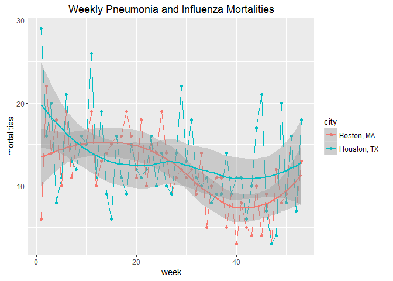
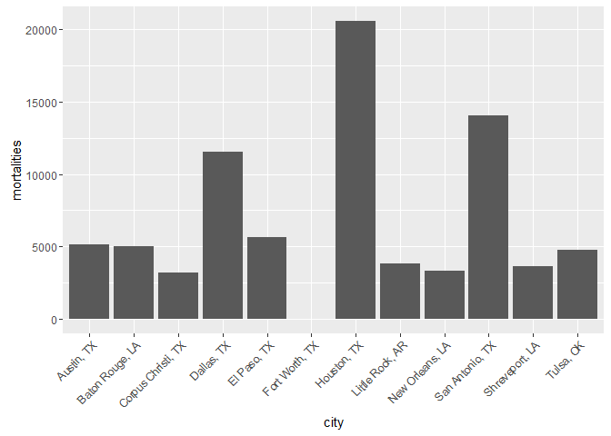

R Demo
================

Example
-------

``` r
library(readr)
library(dplyr)
```

    ## 
    ## Attaching package: 'dplyr'

    ## The following objects are masked from 'package:stats':
    ## 
    ##     filter, lag

    ## The following objects are masked from 'package:base':
    ## 
    ##     intersect, setdiff, setequal, union

``` r
library(ggplot2)

mmwr <- read_csv("lecture_02_data_tidy.csv")
```

    ## Parsed with column specification:
    ## cols(
    ##   city = col_character(),
    ##   year = col_integer(),
    ##   week = col_integer(),
    ##   coordinates = col_character(),
    ##   age_range = col_character(),
    ##   mortalities = col_double(),
    ##   region = col_character()
    ## )

``` r
df <- mmwr %>%
    filter(city == "Houston, TX" | city == "Boston, MA",
           age_range == "pna_inf")
```

### Graph

``` r
ggplot(df, aes(x = week, y = mortalities, color = city)) +
    geom_point() +
    geom_line() +
    geom_smooth() +
    ggtitle("Weekly Pneumonia and Influenza Mortalities")
```



Bar
---

``` r
df2 <- mmwr %>%
    filter(region == "W.S. Central",
           age_range == "All Ages")
```

``` r
ggplot(df2, aes(x = city, y = mortalities)) + 
    geom_bar(stat = "identity") +
    theme(axis.text.x = element_text(angle = 45, hjust = 1))
```

    ## Warning: Removed 59 rows containing missing values (position_stack).


