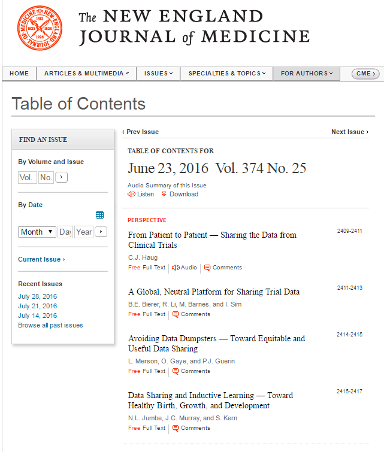
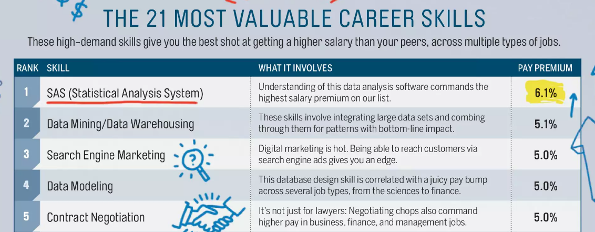

Big Data Overview
========================================================
author: Brian Gulbis and Jennifer Gass
date: August 17, 2016
autosize: true

Overview of Data Series
========================================================

* Big Data Overview
* Data Storage and Implications
* Collecting Data Efficiently
* Organizing Data for Analysis
* Visualizing and Reporting Data

Objectives
========================================================

* Define big data
* Describe how big data is important to healthcare
* Determine where to get big data
* Identify precautions when using big (and little) data

Big Data
========================================================

* Describes the large volume of data (both structured and unstructured) which is available to businesses on a daily basis
* Can be analyzed to make better and more strategic decsisions
    - Cost reductions
    - Time reductions
    - New or optimized products and services
    - Smarter decision making

<small>http://www.sas.com/en_us/insights/big-data/what-is-big-data.html</small>

Big Data in Healthcare
========================================================

* Preventative medicine
    - Combine data from multiple sources to create predictive models
        + Fitness trackers, medical and insurance records, genetic data, etc.
* Clinical trials
    - Data often kept in silos
        + 96% of potentially available data on cancer patients has not been analyzed
    - Data-sharing will allow for new discoveries which otherwise would not be apparent

<small>[Forbes](http://www.forbes.com/sites/bernardmarr/2015/04/21/how-big-data-is-changing-healthcare/#ee268ec32d91)</small>

NEJM TOC
========================================================
title: false

Big Data in Healthcare
========================================================

* Personalized medicine
    - Tailor medicine to an individuals genetic makeup
* Preventing spread of epidemics
    - Mobile phone location data used to track population movements

<small>[Forbes](http://www.forbes.com/sites/bernardmarr/2015/04/21/how-big-data-is-changing-healthcare/#ee268ec32d91)</small>

Big Data at SCCM
========================================================
type: section

* 11 minutes

How is this relevant to me?
========================================================
type: prompt
incremental: true

Like it or not, big data is going to significantly shape your career

Relevance of Big Data
========================================================

* Patient care
* Research
* Career advancement

Big Data in Research
========================================================
<blockquote class="twitter-tweet" data-lang="en">
Number of pubs looking at <a href="https://twitter.com/hashtag/BigData?src=hash">#BigData</a> &amp; <a href="https://twitter.com/hashtag/Health?src=hash">#Health</a> on <a href="https://twitter.com/hashtag/PubMed?src=hash">#PubMed</a> are sky-rocketing <a href="https://twitter.com/hashtag/MadeWithR?src=hash">#MadeWithR</a> <a href="https://twitter.com/hashtag/rstats?src=hash">#rstats</a> <a href="https://t.co/BDNLVPigx1">pic.twitter.com/BDNLVPigx1</a>
&mdash; Matt Crowson (@DrMattCrowson) <a href="https://twitter.com/DrMattCrowson/status/761006072698118144">August 4, 2016</a></blockquote>

Data Skills for Career Advancement
========================================================

<small>MONEY and PayScale.com. Published in June 2016 MONEY magazine</small>

Ways to Utilize Big Data
========================================================

1. New sources of data for traditional analysis
1. Identify new causal relationships
1. New analytical methods (i.e., machine learning)
1. Integration of clinical information with operations and research

<small>Iwashyna, TJ. Big Data. SCCM Annual Congress 2016</small>

Data in Research
========================================================

* Data is the second most important thing in research
* The question being asked is the first
* Data may limit or enable certain questions
* It does not matter how much data you have if you are not asking the right question

<small>[The Data Scientist's Toolbox - Coursera](https://www.coursera.org/learn/data-scientists-tools)</small>

Sources of Data
========================================================

* Hospital / system databases
    - Care4, Sovera (manual)
    - EDW, TheraDoc, Cardinal DCOA
* National organizations
    - UHC/Vizient Clinical Data Base / Resource Manager
* Public Data
    - Hospital Compare, Registries

The Problem
========================================================

* Having all of this data is great!
    - Allows for studies with much larger scopes to be completed in reasonable time frames
    - Can perform more in-depth analysis
* Unfortunately, data rarely comes "ready-to-use"
* Preparing the data requires some technical know-how and additional tools
