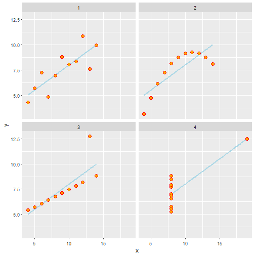

(Exploratory) Data Analysis
========================================================
author: Brian Gulbis and Jennifer Gass
date: January 4, 2017
autosize: true
css: mhtmc.css

You finally have some data!!!
========================================================
type: mhtmc
incremental: true

* Now what?

Objectives
========================================================
type: mhtmc

* Exploratory data analysis
* Visualization in exploration
* Choosing charts

First...
========================================================
type: mhtmc

* Before doing any analysis, you must have one or more questions that you want answered

Exploratory Data Analysis
========================================================
type: mhtmc

* Goal is to understand your data
* Identify possible patterns and relationships
* Two primary methods
    - Create summaries
    - Visualize

Summaries
========================================================
type: mhtmc

* Calculate summaries on your data
    - Discrete data
        + Counts
        + Proportions
    - Continuous data
        + Means
        + Medians

Tables
========================================================
type: mhtmc

* Summaries usually presented in tables
* Helpful for looking at the raw numbers
* May be more difficult to quickly identify differences

Visualization
========================================================
type: mhtmc

* Use rudimentary plots to examine the data
* Helps to identify patterns and areas of additional exploration
* Many researches skip this step... but you shouldn't!

Example
========================================================
type: mhtmc

* Anscombe dataset

```
  x1 x2 x3 x4   y1   y2    y3   y4
1 10 10 10  8 8.04 9.14  7.46 6.58
2  8  8  8  8 6.95 8.14  6.77 5.76
3 13 13 13  8 7.58 8.74 12.74 7.71
4  9  9  9  8 8.81 8.77  7.11 8.84
5 11 11 11  8 8.33 9.26  7.81 8.47
6 14 14 14  8 9.96 8.10  8.84 7.04
```

Summaries of Example Set
========================================================
type: mhtmc


|group | mean_x| sd_x| mean_y| sd_y|
|:-----|------:|----:|------:|----:|
|1     |      9| 3.32|    7.5| 2.03|
|2     |      9| 3.32|    7.5| 2.03|
|3     |      9| 3.32|    7.5| 2.03|
|4     |      9| 3.32|    7.5| 2.03|

Statistical Comparison
========================================================
type: mhtmc


```

	Pairwise comparisons using t tests with pooled SD 

data:  df$x and df$group 

  1 2 3
2 1 - -
3 1 1 -
4 1 1 1

P value adjustment method: holm 
```

Statistical Comparison - ANOVA
========================================================
type: mhtmc


```
Analysis of Variance Table

Response: x
          Df Sum Sq Mean Sq F value Pr(>F)
group      3      0       0       0      1
Residuals 40    440      11               
```

Assessment of the Data
========================================================
type: mhtmc
incremental: true

* How many think the groups are the same?
* Let's plot the data

Visualization of Example Set
========================================================
type: mhtmc
incremental: true



Visualization
========================================================
type: mhtmc

* Graphs help us understand the data and it's properties
    - Otherwise, we would have assumed the groups in this data were the same
* Identify patterns and potential relationships between variables
* Debug analysis

Exploratory Plots
========================================================
type: mhtmc

* Exploratory plots are usually only for the investigator(s)
* Often want to create many plots quickly
    - Not worried about making them look pretty
* May be able to make some plots in Excel, but many plots will require a statistical program
    - SPSS
    - R
* We'll talk about making finished plots to communicate results next time

Principles of Analytic Graphics
========================================================
type: mhtmc

Coursera Video - Exploratory Data Analysis

<small>Peng R. Exploratory Data Analysis. Coursera</small>

Principles of Analytic Graphics
========================================================
type: mhtmc

1. Show comparisons
1. Show causality or explanation
1. Show multivariate data
1. Integrate evidence
1. Describe and document evidence with lables, scales, sources, etc.
1. Content is king

<small>Peng R. Exploratory Data Analysis. Coursera</small>
<small>Tufte E. Beautiful Evidence. 2006</small>

========================================================


Types of Charts
========================================================
type: mhtmc

* Comparison
    - Bar chart
    - Line chart
    - Box plot
* Distribution
    - Histograms

***

* Composition
    - Bar chart
    - Pie chart
* Relationship
    - Scatter chart

========================================================
type: mhtmc_final
