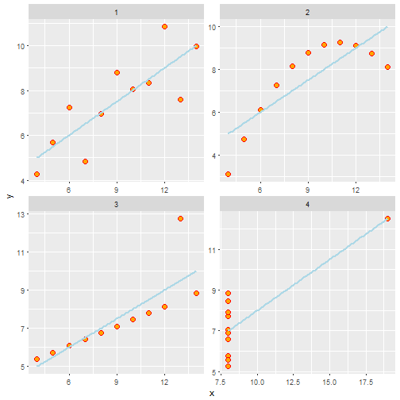

Exploratory Data Analysis
========================================================
author: Brian Gulbis
date: December 9, 2016
autosize: true

Objectives
========================================================

* Need for exploring data
* Visualizing data as part of exploration

You finally have some data!!!
========================================================
incremental: true

* Now what?
* Perform an exploratory data analysis

Exploratory Data Analysis
========================================================

* Goal is to understand your data
* Identify possible patterns and relationships
* Two methods
    - Create summaries
    - Visualize

Summaries
========================================================

* Calculate summaries on your data
    - Discrete data
        + Counts
        + Proportions
    - Continuous data
        + Means
        + Medians

Visualization
========================================================

* Use rudimentary plots to examine the data
* Helps to identify patterns and areas of additional exploration
* Many researches skip this step... but you shouldn't!

Example
========================================================

* Anscombe dataset

```
'data.frame':	11 obs. of  8 variables:
 $ x1: num  10 8 13 9 11 14 6 4 12 7 ...
 $ x2: num  10 8 13 9 11 14 6 4 12 7 ...
 $ x3: num  10 8 13 9 11 14 6 4 12 7 ...
 $ x4: num  8 8 8 8 8 8 8 19 8 8 ...
 $ y1: num  8.04 6.95 7.58 8.81 8.33 ...
 $ y2: num  9.14 8.14 8.74 8.77 9.26 8.1 6.13 3.1 9.13 7.26 ...
 $ y3: num  7.46 6.77 12.74 7.11 7.81 ...
 $ y4: num  6.58 5.76 7.71 8.84 8.47 7.04 5.25 12.5 5.56 7.91 ...
```

Summaries of Example Set
========================================================


|group | mean_x| sd_x| mean_y| sd_y|
|:-----|------:|----:|------:|----:|
|1     |      9| 3.32|    7.5| 2.03|
|2     |      9| 3.32|    7.5| 2.03|
|3     |      9| 3.32|    7.5| 2.03|
|4     |      9| 3.32|    7.5| 2.03|

Statistical Comparison
========================================================


```

	Welch Two Sample t-test

data:  x by group
t = 0, df = 20, p-value = 1
alternative hypothesis: true difference in means is not equal to 0
95 percent confidence interval:
 -2.949998  2.949998
sample estimates:
mean in group 1 mean in group 2 
              9               9 
```

Visualization of Example Set
========================================================



Types of Plots
========================================================

* Scatterplots
* Box plots
* Bar plots
* Line plots
