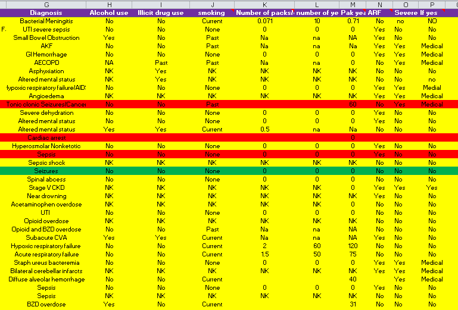

Planning for Data Collection
========================================================
author: Brian Gulbis
date: August 4, 2020
autosize: true

Objectives
========================================================

* Organizing data collection sheet
* Collecting data efficiently

Project Process
========================================================

* Planning and approval
* Data collection
* Data tidying (preparing for analysis)
* Data analysis
* Present findings

Common Mistakes
========================================================

* Trying to collect and analyze everything in the same file
* Minimal preparation and testing
* Using tools which are not designed for efficient data collection
    - Poorly organized fields
    - Spreadsheets (without a data entry form)
* Recording aggregated data
    - Platelet decrease > 50% from baseline (Y/N)
    - Heparin dose in units/day

Plan Each Step Separately
========================================================
* Optimize your process for each step
    - Data collection
    - Data tidying
    - Data analysis
* Each should occur in own place (file / sheet) using tools designed for that step

Data Organization
========================================================

* Data typically organized in rows and columns
    - Rows: observations
    - Columns: variables
* Should follow the principles of "tidy data"

***

id | age | sex
---|-----|----
1 | 54 | male
2 | 72 | female
3 | 45 | female

Principles of Tidy Data
========================================================

* Each variable should be in one column
    - Data within the column should be of the same type
* Each observation of that variable should be in a different row
* Variable names should be stored in the first row
    - Names should be descriptive and readable
    - Use minimal abbreviations
    - Avoid having spaces in name
        + Good: med_name, sedativeRate
        + Bad: clnevnt, ce, clinical event

<small>Wickham, H. Tidy data. J Stat Software 2014; 59 (10)</small>

Principles of Tidy Data
========================================================

* Variables of different "kinds" should be stored in separate tables
    - Ex: Demographic data stored separately from vital sign data
* Each table should be stored in its own sheet or file
* Tables should have a column which allows them to be linked

<small>Wickham, H. Tidy data. J Stat Software 2014; 59 (10)</small>

Organization Tidy Data
========================================================

* Wide Format
    - Variables are spread
* Long Format
    - Variables are stacked

Wide Format
========================================================

Patient|Date|SBP|DBP|HR
-------|----|---|---|---
1|2016-09-01|145|95|65
2|2016-09-02|156|89|76

Long Format
========================================================

Patient|Date|Measure|Reading
-------|----|-------|-------
1|2016-09-01|SBP|145
1|2016-09-01|DBP|95
1|2016-09-01|HR|65
2|2016-09-02|SBP|156
2|2016-09-02|DBP|89
2|2016-09-02|HR|76

Statistical Analysis
========================================================

* Most statistical programs (i.e., SPSS) need the data in the wide format
    - There should be only one observation per patient
* Some data is best collected using the long format
    - Data with multiple observations (i.e., vitals, labs, med doses)
    - Data must be transformed into summary values for analysis
        + Pivot tables, functions, other software
        + Will discuss how to do this in another presentation!

Common Problems with Messy Data
========================================================

* Column headers are values, not variable names
* Multiple variables are stored in one column
* Variables are stored in both rows and columns
* Multiple types of observational units are stored in the same table
* A single observational unit is stored in multiple tables

<small>Wickham, H. Tidy data. J Stat Software 2014; 59 (10)</small>

Headers are Values
========================================================

religion|<$10k|$10-20k|$20-30k|$30-40k|$40-50k|$50-75k
--------|-----|-------|-------|-------|-------|-------
Agnostic|27|34|60|81|76|137
Atheist|12|27|37|52|35|70
Buddhist|27|21|30|34|33|58
Catholic|418|617|732|670|638|1116
Don't know/refused|15|14|15|11|10|35
Evangelical Prot|575|869|1064|982|881|1486
Hindu|1|9|7|9|11|34
Historically Black Prot|228|244|236|238|197|223
Jehovah's Witness|20|27|24|24|21|30
Jewish|19|19|25|25|30|95

<small>Data from: [Pew Research Center](http://pewforum.org/Datasets/Dataset-Download.aspx)</small>

<small>Wickham, H. Tidy data. J Stat Software 2014; 59 (10)</small>

Tidy Version
========================================================

religion | income | freq
---------|--------|------
Agnostic|<$10k|27
Agnostic|$10-20k|34
Agnostic|$20-30k|60
Agnostic|$30-40k|81
Agnostic|$40-50k|76
Agnostic|$50-75k|137
Atheist|<$10k|12
Atheist|$10-20k|27

Multiple Variables in Each Column
========================================================

country|year|m014|m1524|m2534|m3544|m4554|m5564|m65|f014
-------|----|----|-----|-----|-----|-----|-----|---|----
AD|2000|0|0|1|0|0|0|0|-
AE|2000|2|4|4|6|5|12|10|3
AF|2000|52|228|183|149|129|94|80|93
AG|2000|0|0|0|0|0|0|1|1
AL|2000|2|19|21|14|24|19|16|3
AM|2000|2|152|130|131|63|26|21|1
AN|2000|0|0|1|2|0|0|0|0
AO|2000|186|999|1003|912|482|312|194|247
AR|2000|97|278|594|402|419|368|330|121
AS|2000|-|-|-|-|1|1|-|-

<small>Data from: World Health Organization</small>

<small>Wickham, H. Tidy data. J Stat Software 2014; 59 (10)</small>

Tidy Version
========================================================

country | year | sex | age | cases
--------|------|-----|-----|------
AD|2000|m|0-14|0
AD|2000|m|15-24|0
AD|2000|m|25-34|1
AD|2000|m|35-44|0
AD|2000|m|45-54|0
AD|2000|m|55-64|0
AD|2000|m|65+|0
AE|2000|m|0-14|2
AE|2000|m|15-24|4
AE|2000|m|25-34|4

Variables Stored in Rows and Columns
========================================================

id|year|month|element|d1|d2|d3|d4|d5|d6|d7|d8
---|----|-----|-------|---|---|---|---|---|---|---|---
MX17004|2010|1|tmax|-|-|-|-|-|-|-|-
MX17004|2010|1|tmin|-|-|-|-|-|-|-|-
MX17004|2010|2|tmax|-|27.3|24.1|-|-|-|-|-
MX17004|2010|2|tmin|-|14.4|14.4|-|-|-|-|-
MX17004|2010|3|tmax|-|-|-|-|32.1|-|-|-
MX17004|2010|3|tmin|-|-|-|-|14.2|-|-|-
MX17004|2010|4|tmax|-|-|-|-|-|-|-|-
MX17004|2010|4|tmin|-|-|-|-|-|-|-|-
MX17004|2010|5|tmax|-|-|-|-|-|-|-|-
MX17004|2010|5|tmin|-|-|-|-|-|-|-|-

<small>Data from: Global Historical Climatology Network</small>

<small>Wickham, H. Tidy data. J Stat Software 2014; 59 (10)</small>

Tidy Version
========================================================

id | date | tmax | tmin
---|------|------|-----
MX17004|2010-01-30|27.8|14.5
MX17004|2010-02-02|27.3|14.4
MX17004|2010-02-03|24.1|14.4
MX17004|2010-02-11|29.7|13.4
MX17004|2010-02-23|29.9|10.7
MX17004|2010-03-05|32.1|14.2

Data Types
========================================================

* Continuous
* Ordinal and Categorical
    - In general, avoid coding as numbers
        + Sex should be "female" or "male"
        + Hypertension should be "true" or "false"
    - Will avoid coding errors when entering data
    - Will avoid confusion when interpreting data
    - Some programs may interpret numbers as continuous data

<small>https://github.com/jtleek/datasharing</small>

Data with Multiple Observations
========================================================

* Data where the variable is measured more than once
    - Vital signs, labs, medication doses
* Options for collection
    - Aggregate data at time of collection
        + Create a single value which represents the data
        + Ex: Average SBP; SBP > 140 (Y/N)
    - Record all observations
        + Aggregate at time of analysis

Aggregating Data
========================================================

* Think it will save time
    - Probably does not; requires time to perform aggregation
* Adds another source of error
    - Calculation errors at time of entry are hard to detect
* May not allow for additional exploratory analysis

Recording Multiple Observations
========================================================

* Each group of repeat measures should be in a separate sheet / file
* Have an ID field which links to main table
    - patient_id
* Have a field which distinguishes each observation
    - date and time
    - observation number

Multiple Observations Example
========================================================

patient_id|date_time|heart_rate
----------|---------|----------
1|2016-05-01 08:05:00|74
1|2016-05-02 08:10:00|68
1|2016-05-03 09:23:00|81
2|2015-07-23 10:36:00|77
2|2015-07-25 11:12:00|93

Missing Data
========================================================

* Missing data should be coded as NA or blank
* Censored data
    - Ex: INR > 10
    - Know something about the missing data
        + Lab value outside detectable range
    - Still coded as NA, but add a new column which indicates the data is censored

<small>https://github.com/jtleek/datasharing</small>

Missing Data Example
========================================================

patient_id|date|inr |censored_high
----------|---------|----|-------------
1|2016-05-01|3.78|
1|2016-05-02|6.92|
1|2016-05-03|NA|True

Storing Your Data
========================================================

* Most people use spreadsheets
    - Widely available
    - Small learning curve for basic functions
* Potential issues
    - Compatibility varies depending on file type
    - Calculated cells may not transfer correctly
    - Limits on number of rows that can be stored
    - No record of any transformations which were done

<small>https://github.com/jtleek/datasharing</small>

Spreadsheet Do's and Dont's
========================================================

* Do
    - Start in cell **A1**
    - Use row 1 for column names
    - Use multiple sheets / files for different types of data
    - Save analysis in separate file
        + Tables, charts, etc.

***

* Don't
    - Highlight, format, or merge cells
    - Use macros
    - Manipulate data without recording what you did

File Naming
========================================================

* Avoid spaces, punctuation, case sensitivity
* Use delimiters to facilitate searching
    - "_" underscore to delimit sections
    - "-" hyphen to delimit words within sections
* Name describes the content
* Start with a number or date for sorting
    - Left pad with zeros (01, 02, etc.)
    - Use "YYYY-MM-DD" standard for dates

<small>[Reproducible Science Curriculum](https://rawgit.com/Reproducible-Science-Curriculum/rr-organization1/master/organization-01-slides.html)</small>

File Naming Examples
========================================================

* 01_raw-data.xlsx
* 02_tidy-data.xlsx
* 2014-04-08_data-for-qi-project.xlsx

Collecting Data Efficiently
========================================================
type: section

Primary Goal of Data Collection
========================================================
incremental: true

* Gather all data needed for a project as __efficiently__ and __accurately__ as possible

Preparation - Form Design
========================================================

* Organize to facilitate efficient data collection
    - Data points should be grouped based on where they are in the medical record
    - May be different than how we group information to analyze
* Have choices to select from as much as possible
    - Ex: Drop down list
    - Faster than writing / typing
    - Ensures consistency in data entry

Why Make a Form if Pulling Data Electronically?
========================================================

* Helps to visualize all of the data points
    - Identify if any data needed to determine the outcomes is missing
* Helps communicate your needs to the person pulling the data

Using Spreadsheets for Data Collection
========================================================

* If not properly designed
    - Easy to have inconsistent data entry
    - Easy to enter data in wrong place
    - Beware automatic type conversion
        + Ex: Dates
* Use a data entry form to get data into spreadsheet
* Use data validation to minimize entry errors

Data Entry Forms
========================================================

* Excel Data Form
    - Quick Access Toolbar -> More Commands
    - Choose commands from -> All Commands
    - Scroll to Form and click Add
* Google Forms
    - Links to Google Sheets
    - More customizable than basic Excel form

Data Validation
========================================================

* __Checking the data to make sure it is accurate is one of the most important steps__
* Almost every data set is going to have mistakes in it
* Errors can skew results
* Many researchers overlook this step

Sources of error
========================================================

* Incorrectly charted in EMR
* Erroneous lab results
* Recorded incorrectly by researcher upon collection or database entry
* Incorrect calculations when manipulating / tidying

Messy Data Example
========================================================



Data Example Examined
========================================================


* Diagnosis
    - Number of distinct values: 167
* Alcohol Use


```
   0   NA   nk   Nk   NK   no   nO   No   NO Past  yes  Yes NA's 
   2    1   32    4   91  108    1  133    3    1   17   54    8 
```

* Number of packs/day
    - Contains numeric and non-numeric data
* Column P heading: "If yes"
    - Unclear what this data represents

Summary
========================================================

* Data organized in rows and columns
* Follow tidy data principles
* Develop a data collection form and test it for efficiency and accuracy
* Use a data entry form when using spreadsheet
* Collect all observations, not aggregated data
* Validate your data

